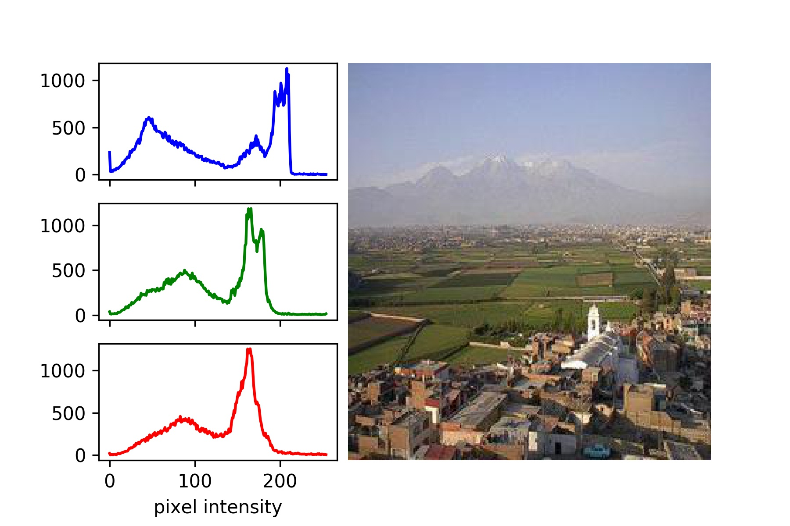

# Variational Bayes on Mixtures of Gaiussians

In the application generative probabilistic models, often introducing latent variables help govern the distribution of the data. In Bayesian statistics, one central task is to make inferences on the latent variables. Consider a joint density of latent variables $z=z_{1:m}$ and observations $x=x_{1:n}$,
\begin{alignat}{1}\label{eq:1}
p(z,x) = p(z)p(x | z)
\end{alignat}
where $p(z)$ is the prior density and $p(x|z)$ is the likelihood. In Bayesian inference, one is interested to find the posterior $p(z|x)$. However, in serious applications, this posterior is often hard to calculate. Markov chain Monte Carlo (MCMC) sampling is a traditional strategy, which can generate asymptotically exact samples from the target distribution. However, it scales poorly to large datasets and complex models.

Variational inference (VI) has been proposed as an altervative method to approximate Bayesian inference which could scale to large dataset. Rather than use sampling in MCMC, variational inference uses the following optimization to do approximation. \begin{alignat}{2}\label{eq:2}
q^{\ast} (z) = \underset{q(z)\in \mathscr{Q}}{\operatorname{argmin}} \mathrm{KL} (q(z) || p(z|x))
\end{alignat}
where $\mathscr{Q}$ is a family of approximate densities, which is both flexible enough to capture the information in $p(z|x)$ and computationally tractable.

We try to replicate some results reported in this [paper](https://arxiv.org/abs/1601.00670). We will apply variational inference on the mixture of Gaussians and the numerical experiments can provide insights on its mechanism.

## Documentation

Please [read this report for details](report/main.pdf)

## Demo

* Old Faithful

* Simulated Data

* Image Classification

